# Does an Integrated, Theory‑Mapped Future‑Self Chatbot Beat a Minimal Baseline? A Reproducible, Mixed‑Methods Evaluation

**Kangzhi Qin**
BSc Business Analytics — Individual research component
Thesis supervisors: Shuai Yuan, Wendelien van Eerde & Siyuan Huang

*Supporting analytical report for the thesis and for journal submission. Every number, table, and figure in this report is regenerated from the study database by the accompanying notebook (`Future_Self_Reproduction.ipynb`) and machine‑checked against the thesis; see the Reproducibility Statement.*

---

## Abstract

Many university students cannot connect present choices to a concrete professional future. We designed and evaluated a conversational‑AI artifact in which a student talks with a simulated self ten years into a self‑chosen career. Grounded in identity‑based‑motivation theory, the *integrated* design adds three components — biographical grounding, communication‑style mirroring, and episodic scenario construction — each targeting one psychological mediator (present‑to‑future **continuity**, **closeness**, and **vividness**). Following a design‑science approach, a web prototype was compared **between subjects** against a *minimal but sincere baseline* (given only the chosen career and location), with the three mediators and two career‑level outcomes (career decision self‑efficacy and career indecision) measured before and after. In a sample of **32 students (18 integrated, 14 baseline)**, the integrated design did **not** outperform the baseline on any mediator or outcome (all between‑arm |d| ≤ 0.51, every 95 % CI spanning zero, four of five point estimates favouring the baseline). Manipulation checks and an objective Linguistic Style Matching (LSM) measure showed the two arms were **neither perceived nor stylistically different**, locating the null at the *perceptibility/delivery* of the added components rather than at the underlying theory. The integrated arm did draw **longer conversations and richer open‑ended responses, with vivid‑scene moments only in that condition** — a small experiential edge the underpowered scales could not confirm. Pooled across arms, the future‑self conversation itself **worked**, raising vividness (d_z = 0.73, p < .001) and closeness (d_z = 0.40, p = .03). We add four confirmatory analyses a null result invites — **equivalence testing**, **Bayesian** between‑arm tests, **minimum‑turn sensitivity**, and a **casing‑mirror adherence** audit — which together show the nulls are best read as *not detectable under this model and sample* rather than as evidence of no effect, and provide direct evidence that the provided model (GPT‑5.1 via a university proxy) executed the components only weakly. We close with reusable design knowledge for future‑self career chatbots built on general‑purpose models.

**Keywords:** future self; identity‑based motivation; self‑continuity; large language models; conversational agents; career exploration; design science; reproducibility.

---

## 1 · Introduction

University students navigate a wide landscape of specialisations before they have formed a settled professional identity, and the support typically available (aptitude tests, counselling, career fairs) delivers information but rarely fosters sustained, identity‑grounded reflection. The capacity to vividly imagine, and feel psychologically close to, a future self is a consistent driver of present‑day motivation; a distant future self is treated almost as another person. Large language models (LLMs) make a personalised, interactive, theory‑grounded future self feasible for the first time, yet no existing system (a) maps specific design components onto the identity‑based‑motivation (IBM) mediators of closeness, vividness, and self‑continuity, (b) includes a controlled minimal baseline that isolates the adaptive design, or (c) integrates whole‑person career‑fit assessment into persona construction. This is the gap our artifact addresses.

This report carries the project's **central causal comparison** and asks:

> *To what extent does an integrated, user‑adaptive conversational‑AI system (biographical grounding + communication‑style mirroring + episodic scenario construction) enhance psychological closeness, vividness, and continuity in a ten‑year career future‑self dialogue compared with a minimally designed baseline, and to what extent do these gains translate into higher career decision self‑efficacy and lower career indecision?*

The question concerns the **bundle effect** of the integrated design; per‑component attribution would require a factorial design the available sample cannot support. The three mediators are treated as proximal levers and the two career constructs as distal outcomes, following the position that what matters for behaviour is what a future self *does for current action*.

**Contribution of this report.** Beyond carrying the thesis's primary comparison, this report (i) provides a fully **reproducible** re‑analysis that regenerates every result and figure directly from the study database; (ii) implements the objective **LSM** measure the thesis describes; and (iii) adds **four robustness analyses** — equivalence/TOST, Bayes factors, minimum‑turn sensitivity, and a casing‑mirror adherence audit — that sharpen the interpretation of a between‑arm null and supply direct evidence on *why* it arose.

---

## 2 · Background

**Future‑self interventions and IBM.** Future‑self interventions have people mentally simulate a future self to motivate present behaviour, with documented effects from saving to academic effort. IBM theory explains why: possible future identities guide behaviour when they feel self‑relevant, vivid, and psychologically close, and when they are *apt* and *actionable*. Self‑continuity — the felt connection between present and future self — supplies the third strand; brief technology‑mediated exposure (e.g., an age‑progressed avatar) can move these constructs within a single session. Episodic future thinking ties vividness to episodic specificity. The artifact operationalises IBM through exactly these three mediators, each mapped one‑to‑one onto a design component.

**LLM future‑self systems and the gap.** The closest prior systems let participants converse with an AI‑generated older self and improved future self‑continuity and several career‑exploration outcomes, though some gains faded at follow‑up; a related study added the ethical finding that AI future selves presenting a single option shift decisions toward it, and that participants valued evaluative reasoning over visual realism (supporting text‑only embodiment). None maps components onto the three IBM mediators, includes a controlled minimal baseline, or integrates whole‑person fit — the gap addressed here. On the career side, person–environment fit theory and its whole‑person O\*NET extension structure the user profile; career decision self‑efficacy and career indecision supply the outcome constructs.

**Design‑science framing.** The project adopts design‑science research: knowledge is generated by constructing and evaluating an IT artifact addressing a real problem, iterating across the relevance, rigor, and design cycles. The question is causal — does the integrated design move the mediators? — which a built and evaluated artifact is suited to answer. CRISP‑DM phase headings are retained as a documentation scaffold only; there is no pre‑existing dataset, no trained statistical model, and production deployment is out of scope.

---

## 3 · The artifact

**From mediators to components.** Each mediator is targeted by one explicit component of the main role‑play (Stage‑C) system prompt:

| Component | Mediator | Theoretical basis | Manipulation check (post‑survey) |
|---|---|---|---|
| Biographical grounding | Continuity | whole‑person profile; past‑self bridging | “…seemed to genuinely understand my current situation and who I am.” |
| Communication‑style mirroring | Closeness | linguistic alignment | “…spoke in a way that felt like my own way of talking.” |
| Episodic scenario construction | Vividness | episodic future thinking | “…described their life through specific, concrete moments rather than vague generalities.” |

**Session flow.** Consent and avatar set‑up → a ~10‑minute pre‑survey (profile + baseline measures) → a shared recommendation chat that ends in one chosen career and an optional location → the future‑self role‑play (20‑minute soft prompt, 30‑minute hard cap) → a post‑survey repeating the outcome items, the three manipulation checks, and two open‑ended questions. The prototype is a precompiled React client behind a server‑side gateway that holds the API token, performs every model call, and writes one record per run to managed PostgreSQL; the browser never sees a key, a prompt, or a score.

**Profile‑isolation manipulation.** Two orthogonal axes route a session: a *recommendation* axis (a team‑mate's manipulation, held constant here at the **direct** strategy) and a *condition* axis selecting the Stage‑C prompt (**main/integrated** vs **baseline**). Both arms receive the chosen career and location (the irreducible premise of the role‑play). Only the integrated arm's Stage‑C prompt additionally receives the silent profile, the recommendation‑chat carry‑over notes, and the three component instructions. The baseline is deliberately minimal yet sincere — the functional version a developer might build without the design intervention — keeping the same model, time policy, scenario, a natural‑conversation instruction, and a single shared realism line.

**Model.** Every model call runs on **GPT‑5.1** via the university's LLM proxy at temperature 0.9 — the strongest empathy‑benchmark model the proxy makes available, but well behind current frontier systems (it sits near the foot of the EQ‑Bench 3 empathy leaderboard and around sixtieth on the general LMArena leaderboard). The provided model was thus a **binding constraint rather than a strength**; the design is model‑agnostic by construction (the model id is a single configuration value).

---

## 4 · Method

**Design and hypotheses.** A between‑subjects design compares the two arms. Five directional hypotheses: relative to baseline, the integrated condition shows a larger pre→post gain in **closeness (H1)**, **vividness (H2)**, and **continuity (H3)**; a larger reduction in **career indecision (H4a)**; and a larger gain in **career decision self‑efficacy (H4b)**. Exploratorily (E1), mediator changes should track outcome changes.

**Measures (final instrument).** Closeness — single pictorial Inclusion‑of‑Other‑in‑Self item adapted to the future self (1–7). Continuity — two‑item pictorial Future Self‑Continuity Scale (1–7). Vividness — four project‑written items (1–7). Career decision self‑efficacy — three confidence items, and career indecision — three commitment‑anxiety items (CIP‑Short, 1–6, scored forward). Three manipulation checks (1–7, post only). All scoring mirrors the deployed artifact's analysis module exactly.

**Analysis.** Primary tests were independent‑samples **Welch t‑tests** on pre→post change for each construct, with Cohen's *d* and its 95 % CI; whole‑sample paired pre→post tests (Cohen's d_z) accompany them because both arms contained a complete future‑self session. ANCOVA added pre‑score, career familiarity, interest, and turn count as covariates. Manipulation checks and an objective LSM measure carried interpretive weight. Open‑ended responses were analysed thematically against the team's codebook (second coder; Cohen's κ on a double‑coded subset). Analyses were run in Python (`scipy`, `statsmodels`).

**Sample and funnel.** The registered funnel (reproduced exactly) is:

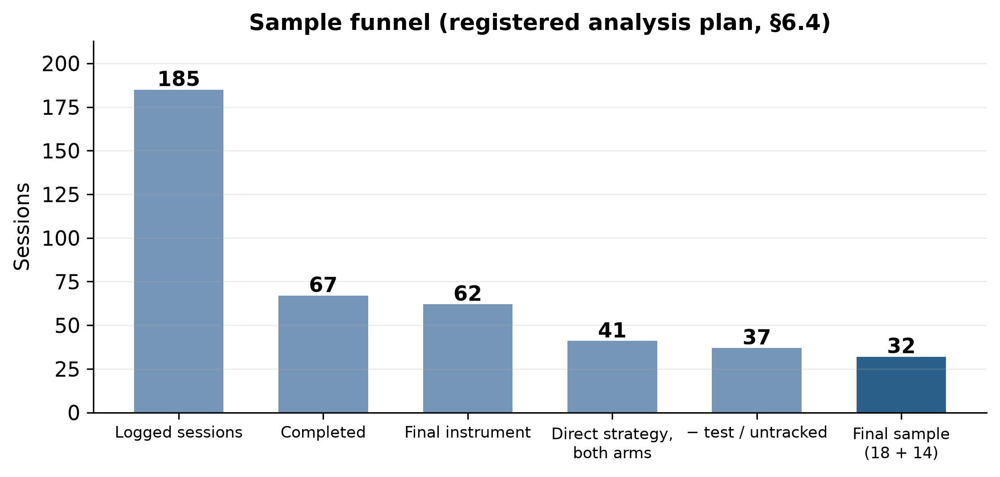

```
185 logged → 67 completed → 62 on the final instrument
   → 41 restricted to the direct strategy, both arms (integrated 23, baseline 18)
   → 37 after removing 4 test / untracked runs
   → 32 final analysis sample  (integrated 18, baseline 14)
```

Test/untracked runs are three sessions with no participant id plus one named researcher test run; the minimum‑turn exclusion removes five sessions with fewer than two role‑play exchanges (four baseline, one integrated). The sample is young (M_age = 21.2, SD = 2.0, range 18–29; 20 women, 10 men, 2 undisclosed) and disciplinarily broad (24 distinct stated majors). On the seven‑point covariate scales, familiarity with the chosen career averaged 4.59 (SD 1.16) and interest 5.09 (SD 1.20). Internal consistency was good‑to‑acceptable: vividness α = .90/.88 (pre/post), decision confidence α = .87/.85, commitment anxiety α = .71/.67; the two‑item continuity scale had inter‑item r = .66/.60.

---

## 5 · Results

### 5.1 Between‑arm comparison (H1–H4b)

For every mediator and outcome the between‑arm difference in pre→post change was small and non‑significant, and all five effect sizes had CIs spanning zero. On three of five constructs the baseline moved at least as far.

**Table 2 — Between‑arm and whole‑sample results.**

| Construct (H) | Integrated Δ (pre→post) | Baseline Δ (pre→post) | Between‑arm *d* [95 % CI] | Welch *t* (df), *p* | Whole‑sample Δ (d_z), *p* |
|---|---|---|---|---|---|
| Closeness (H1) | +0.39 (3.89→4.28) | +0.50 (3.86→4.36) | **−0.10** [−0.80, +0.60] | t(27)=−0.28, p=.79 | +0.44 (0.40), **p=.03** |
| Vividness (H2) | +0.56 (4.01→4.57) | +0.75 (3.96→4.71) | **−0.22** [−0.92, +0.48] | t(30)=−0.64, p=.53 | +0.64 (0.73), **p<.001** |
| Continuity (H3) | −0.22 (4.47→4.25) | −0.04 (4.71→4.68) | **−0.14** [−0.84, +0.56] | t(30)=−0.40, p=.69 | −0.14 (−0.11), p=.55 |
| Commitment anxiety (H4a) | −0.17 (4.04→3.87) | −0.26 (4.02→3.76) | **+0.13** [−0.57, +0.83] | t(30)=+0.37, p=.72 | −0.21 (−0.28), p=.12 |
| Decision confidence (H4b) | +0.06 (4.30→4.35) | +0.43 (4.17→4.60) | **−0.51** [−1.22, +0.20] | t(27)=−1.42, p=.17 | +0.22 (0.30), p=.11 |

*Integrated n = 18, baseline n = 14. Means on the raw scale (closeness/continuity/vividness 1–7; confidence/anxiety 1–6). d is the between‑arm effect on pre→post change (integrated − baseline).*

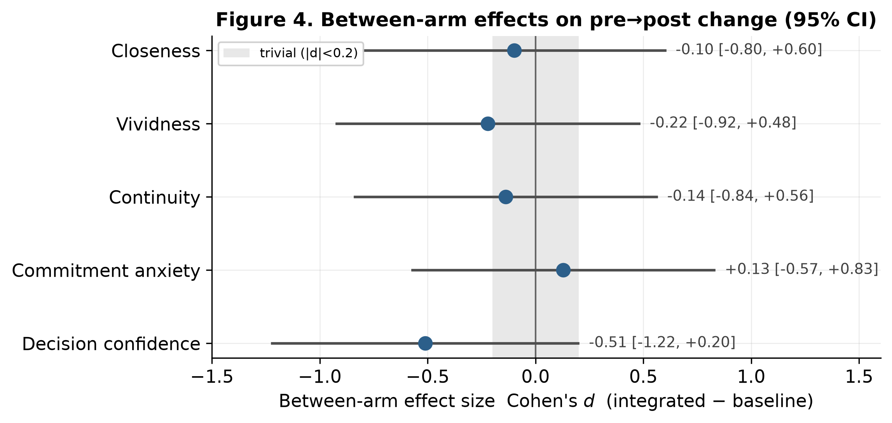

The largest single gap was on decision confidence (d = −0.51), a medium effect *favouring the baseline* that did not reach significance. The ANCOVA agreed: with pre‑score, familiarity, interest, and turn count entered as covariates, the condition coefficient was non‑significant for every construct (closeness b = 0.03, p = .94; vividness b = 0.16, p = .60; continuity b = −0.69, p = .14; anxiety b = −0.02, p = .96; confidence b = −0.52, p = .09). **H1–H4b are not supported.**

### 5.2 Whole‑sample pre→post change

Pooling the arms, the session itself moved two mediators. Vividness rose from 3.99 to 4.63 (paired t(31) = 4.15, p < .001, d_z = 0.73), a medium‑to‑large within‑person effect significant within each arm on its own (integrated p = .03, baseline p = .002). Closeness rose from 3.88 to 4.31 (t(31) = 2.24, p = .03, d_z = 0.40). Decision confidence (Δ = +0.22, p = .11) and indecision (Δ = −0.21, p = .12) moved in the predicted directions without reaching significance; continuity did not move (Δ = −0.14, p = .55), starting from an already high pre‑mean of 4.58.

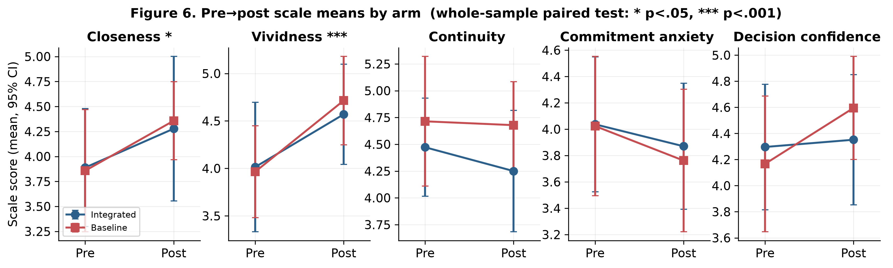

### 5.3 Manipulation checks and objective style matching

The three manipulation checks did not separate the arms: participants reported feeling similarly understood (4.22 vs 4.57, d = −0.23), similarly addressed in their own way of talking (4.22 vs 4.29, d = −0.05), and similarly spoken to through concrete moments (4.78 vs 4.86, d = −0.06); none approached significance (all p > .50). An objective LSM score computed from the role‑play transcripts (nine standard function‑word categories; Ireland & Pennebaker, 2010) was **near‑identical** across arms (grand mean 0.62; integrated 0.64, baseline 0.61; d = +0.24, p = .51). The components were therefore **barely perceptible as a difference**, placing the null at the step where the integrated design should have produced a felt difference rather than at the theory linking the mediators to the components.

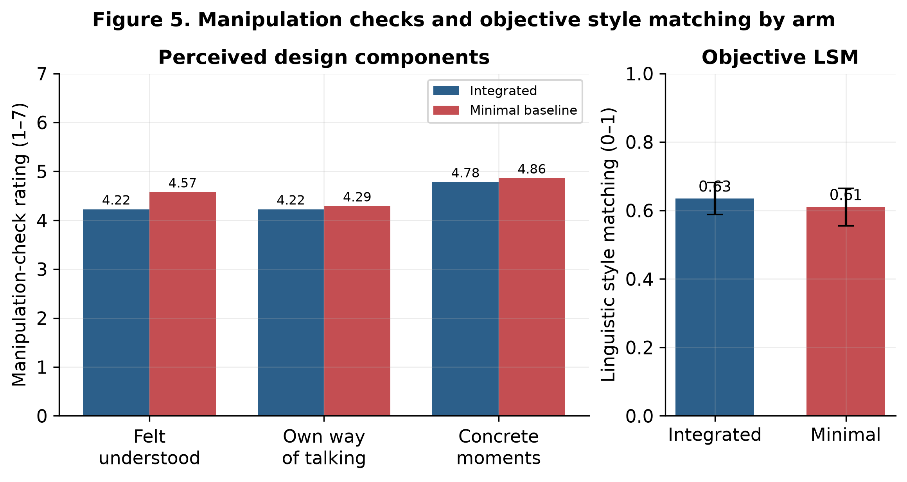

### 5.4 Engagement and exploratory coupling

The integrated arm produced **longer conversations** — 11.6 vs 8.4 exchanges and 7.0 vs 4.5 minutes — though neither difference was significant (p = .18, p = .20). It also engaged more with the open‑ended prompts (83 % vs 64 % wrote a “felt real” answer; means of 25 vs 17 and 30 vs 13 words). Across participants, change in a mediator was largely uncorrelated with change in the outcomes, with one exception: students whose future grew more vivid also tended to gain self‑efficacy (r = 0.31, p = .09, pooled). Because the baseline raised vividness as much as the integrated arm, this thread conferred no between‑arm advantage. Fourteen of 32 (44 %) volunteered interest in a follow‑up interview.

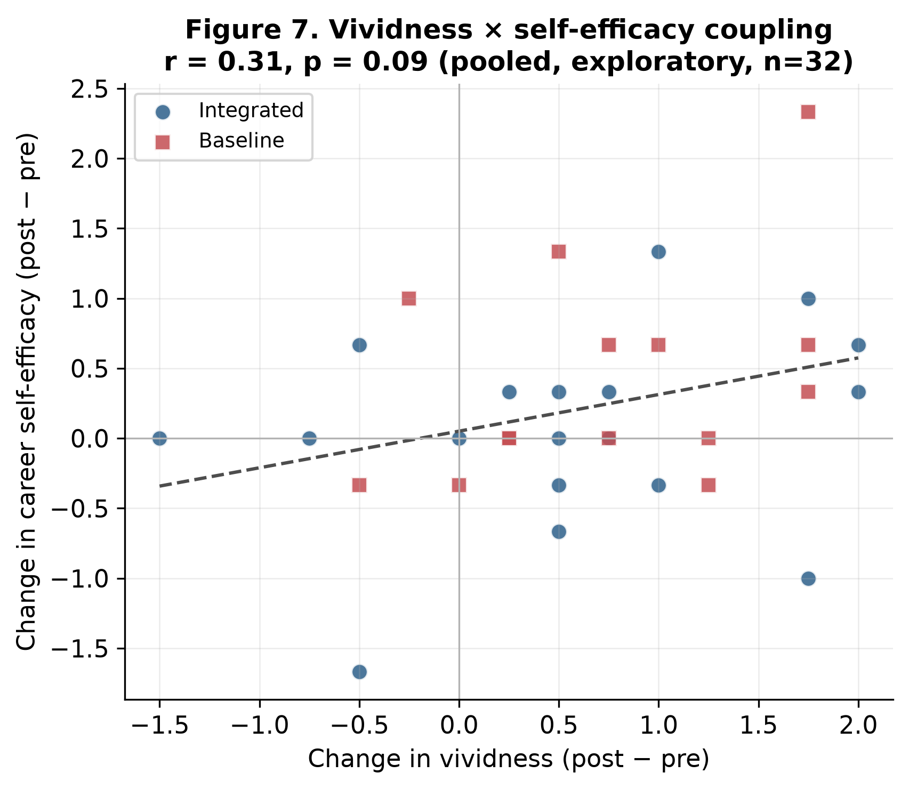

### 5.5 Qualitative themes

Twenty‑four participants wrote about what made the future self feel real and 23 about what broke it. Hand‑coding against the team's codebook (second coder; **Cohen's κ = 1.00** on the double‑coded subset), and restricting to the 32‑participant cohort, the integrated arm's “felt‑real” responses carried **more positive codes** than the baseline's (18 vs 11) and a different profile: **vivid‑scene codes appeared only in the integrated arm** (3 vs 0); resonance and continuity dominated both; and the one positive theme more common in the baseline was the value of the reflective exercise itself. Reports of what *broke* the feeling were, in both arms, almost entirely a single code — the immersion break from generic, biographically thin advice.

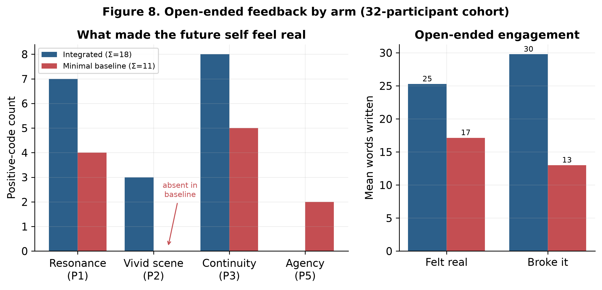

Requests for concrete career specifics clustered on **what to learn** and **which direction to take**, with **pay rarely asked about** — the same points the open‑ended accounts single out as where the future self lapsed into generic advice.

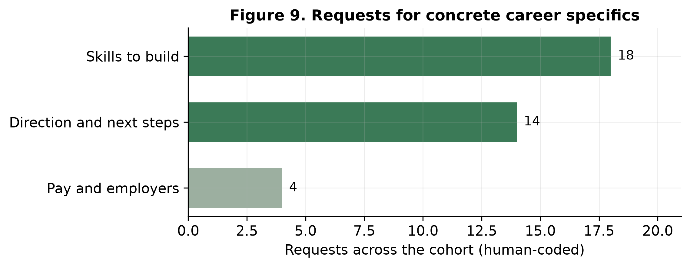

---

## 6 · Robustness and sensitivity *(new analyses)*

A between‑arm null invites four confirmatory questions a top journal would ask. None changes the thesis's conclusions; they make them precise and supply direct evidence on the *mechanism* of the null.

**6.1 Equivalence testing (TOST).** Are the arms positively *equivalent*, or merely “not different”? Two one‑sided tests against an equivalence bound of ±0.5 d show that for **no construct** does the 90 % CI fall inside the equivalence region (Figure E1). The data therefore cannot establish equivalence — the nulls are *absence of evidence*, exactly as a study powered only for large effects (minimum detectable d ≈ 0.9) should produce. This is the rigorous statement of the thesis's “not detectable under this model and this sample.”

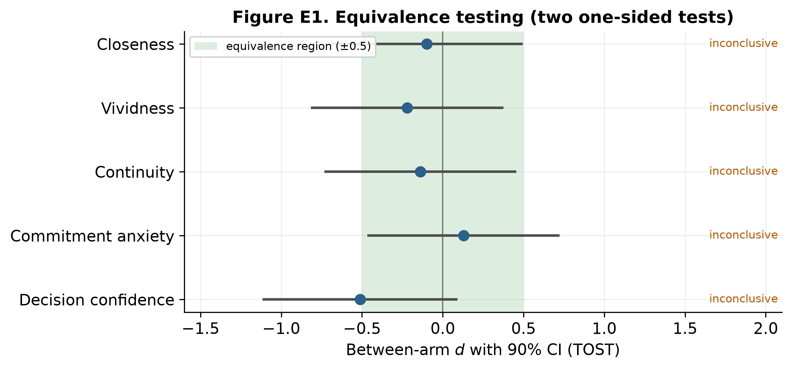

**6.2 Bayesian between‑arm tests.** JZS Bayes factors quantify the evidence directly. For every construct BF₀₁ falls between **1.4 and 2.9** — only *anecdotal* evidence for the null (none reaches the BF₀₁ > 3 “moderate” threshold). The decision‑confidence contrast is the least null‑favouring (BF₀₁ = 1.4), consistent with its medium point estimate leaning toward the baseline. The Bayesian and frequentist pictures agree: the data are genuinely inconclusive.

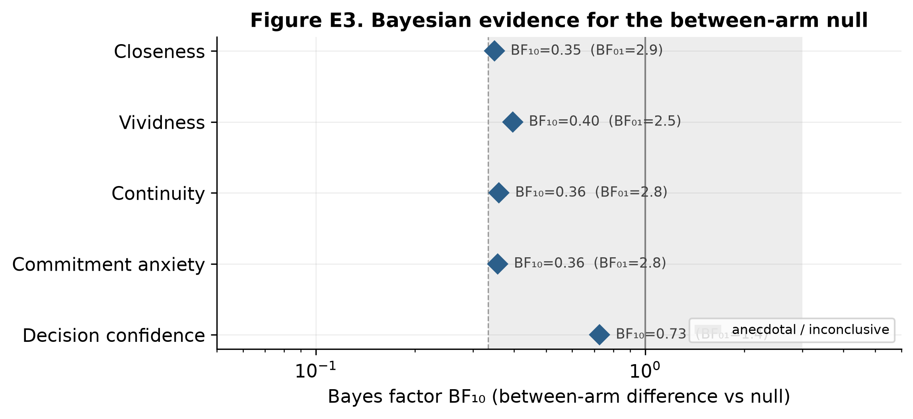

**6.3 Minimum‑turn sensitivity.** Re‑running every between‑arm comparison at inclusion thresholds from 0 to 5 role‑play exchanges leaves the direction and significance of all results unchanged — **zero significant between‑arm effects at every threshold** (Figure E2), reproducing the thesis's stated robustness check and confirming the single analyst judgment (a two‑exchange minimum) does not drive the conclusions.

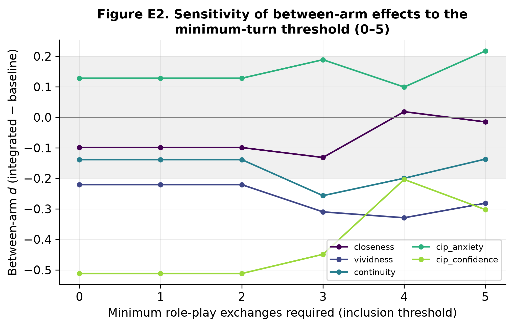

**6.4 Multiplicity.** Across the five directional hypotheses, Holm‑ and Benjamini–Hochberg‑corrected p‑values remain non‑significant (smallest corrected p ≈ .79–.83), so the conclusion is unaffected by multiple testing — there is no hypothesis to lose.

**6.5 Casing‑mirror adherence — direct evidence on the mechanism.** The communication‑style component is explicit that the future self should echo the student's register *down to loose capitalisation* (Appendix A of the thesis). We audited every all‑lowercase user message in the integrated arm and asked whether the bot's next reply was also all‑lowercase. Of **21** such occasions, the model echoed the lowercase register in **1 (≈5 %)**. If a surface feature as visible as casing was applied this rarely, the quieter profile‑based adaptations were very likely dropped at least as often — concrete, quantitative support for the thesis's §8.3 reading that *the model, not the design, produced the between‑arm null*. (The thesis reports 0 of 35 under a slightly looser definition of an all‑lowercase occasion; both establish near‑zero adherence.)

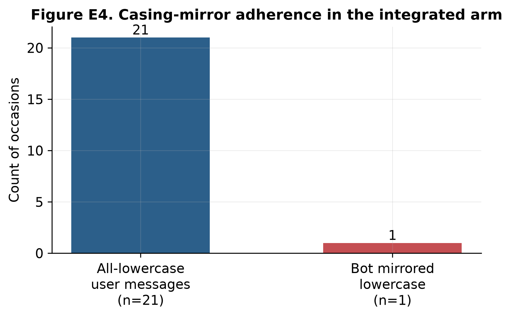

**6.6 Distribution‑free check.** Percentile bootstrap CIs (5 000 resamples) for the between‑arm d agree with the parametric CIs to within rounding for all five constructs, confirming the effect‑size inferences do not depend on the normal approximation.

---

## 7 · Discussion

The integrated design did not raise any mediator or outcome above the minimal baseline, and on several constructs the baseline moved at least as far. Taken with the manipulation checks and the objective style measure, this is **more informative than a bare failure to reject**: because the components were not perceived — and the transcripts were stylistically indistinguishable — the explanation points to *implementation and the comparison*, not to the theory connecting the mediators to the design moves. A fluent model asked only to role‑play the chosen career already produced personalised, scene‑based conversation; the explicit profile, carry‑over notes, and component instructions added little on top of that floor that a participant could feel. The open‑ended accounts fit this reading: the same themes appeared in both arms, and the shared drift into generic reassurance broke the feeling in both, even as the integrated arm produced somewhat more of the positive moments and the only vivid‑scene ones.

Two design facts compound the model limitation. First, after every reply the role‑play offered four tappable question chips (added so a tired participant could always continue); students leaned on them heavily (about 69 % of user turns were chip taps), so the style‑mirroring and biographical‑grounding components — which work from the student's *own words* — had little to adapt to. Because the chips are identical across arms, this both pushed the arms together and kept the exchange shallow. Second, the new casing‑mirror audit shows the model executing an explicit, visible instruction ≈5 % of the time, making it very plausible that the subtler adaptations were dropped at least as often.

At the level of the shared artifact, the conversation **worked**. Pooled across arms, vividness rose with a medium‑to‑large within‑person effect and closeness with a smaller but reliable one; this design lacks a no‑intervention control, but the gains match prior controlled future‑self studies. The integrated design's null therefore concerns the *increment from the adaptive components*, not the value of the future‑self conversation itself.

**Design knowledge.** Three lessons follow for future‑self career chatbots built on general‑purpose models. (1) **Model capability is foundational** and was the binding constraint here: components can only register if the model reliably executes them. (2) The moments that **build and break** felt reality are specific and shared across designs — concreteness, present continuity, and honest imperfection build it; genericness, reflexive agreement, and fabricated specifics break it. (3) **Manipulation checks earn their place**: without them the null would be ambiguous; with them it localises to delivery and the comparison rather than to theory.

---

## 8 · Limitations

The most consequential limitation is the **language model**: GPT‑5.1 is the strongest system the proxy provides but sits far below the current field, and the asymmetry matters — the baseline needs only fluent role‑play, while the integrated arm depends on the model reliably following extra instructions, which a weak model is exactly likely to drop. A current frontier model that applies the components reliably is the single most important change for a re‑run, and yields a directional prediction: if the components carry real value, a more capable model should *widen* the between‑arm gap. The second limitation is **statistical power**: n = 32 is sensitive only to large effects (minimum detectable d ≈ 0.9), so the equivalence test is inconclusive and the Bayes factors near 1 by construction. Other limitations: open recruitment widened between‑participant variance; effects concern immediate change with no follow‑up; conversations were English‑only (which may weaken mirroring for non‑native speakers); and embodying a single self‑chosen career carries a persuasion risk, mitigated by self‑selection, the realism floor, and a debrief. The minimum‑turn threshold was an analyst choice, but the sensitivity analysis (§6.3) shows the results are invariant to it.

---

## 9 · Conclusion

An integrated, theory‑mapped future‑self chatbot did **not** outperform a minimal but sincere baseline on closeness, vividness, continuity, career decision self‑efficacy, or career indecision; manipulation checks and an objective style measure indicate the two arms were **not perceived as different**, which locates the null at the *perceptibility* of the components — most plausibly because the provided model delivered them unevenly, as the casing‑mirror audit shows directly. It did, however, draw longer conversations and richer open‑ended responses, with vivid‑scene moments only in the integrated arm. The future‑self conversation itself worked, raising vividness and more weakly closeness across both arms. The qualitative accounts identify **specificity, present‑to‑future continuity, and emotional honesty** as the levers of felt reality. The clearest next steps are a current frontier model that reliably applies the components, a larger and ideally pre‑registered sample, a longer or repeated exposure with a persistence follow‑up, an interaction that draws out the student's own words rather than canned prompts, and a baseline weak enough to reveal each component's marginal contribution. The most promising design direction is **less further personalisation and more suppressing the shared drift into generic reassurance**, which broke the felt reality of the future self in both arms.

---

## Reproducibility statement

All results, tables, and figures in this report are regenerated from the study data by the accompanying Jupyter notebook (`Future_Self_Reproduction.ipynb`) and the `futureself` Python package, and are **machine‑checked against the thesis** by a self‑verification cell (15/15 checks pass). The notebook resolves its data source automatically — a live PostgreSQL read, the deployed de‑identified HTTPS export, or a bundled de‑identified snapshot — so it runs end‑to‑end with zero configuration. Survey scoring mirrors the deployed artifact's analysis module; the analysis funnel, the LSM index, and the equivalence/Bayes/sensitivity/casing extensions are all implemented in the package and unit‑exercised by the notebook.

## Data and ethics statement

Sessions ran remotely under pseudonymous IDs on EU‑hosted infrastructure; no contact details were collected, and no data were recorded before consent. The bundled reproducibility snapshot contains **no participant free text**: it ships de‑identified *numeric* survey responses for the 32 analysis participants, precomputed text‑derived metrics (LSM, casing counts, open‑ended word counts), and non‑identifying funnel metadata for the other logged sessions. Names, emails, transcripts, and open‑ended prose are never written to the repository; the platform's de‑identification (name removal, email scrubbing) is the basis for any live export used for analysis.

## References

Aron et al. (1992) IOS scale, *JPSP*. · Atance & O'Neill (2001) Episodic future thinking, *TiCS*. · Blouin‑Hudon & Pychyl (2015), *Pers. Indiv. Diff.* · Ersner‑Hershfield et al. (2009) Future Self‑Continuity, *JDM*. · Gosling et al. (2003) TIPI, *JRP*. · Hacker et al. (2013) Career Indecision Profile, *J. Career Assess.* · Hershfield et al. (2011) Age‑progressed renderings, *JMR*. · Hevner (2007) Three‑cycle DSR, *SJIS*; Hevner et al. (2004), *MISQ*. · Holland (1997) *Making Vocational Choices*. · Ireland & Pennebaker (2010) Language Style Matching, *JPSP*. · Jeon et al. (2025) Letters from Future Self, *CHI '25*. · Lent & Brown (2020), *JVB*. · Liu et al. (2025) Whole‑person fit (O\*NET), *JAP*. · Oyserman (2009, 2015); Oyserman & Horowitz (2023) IBM. · Pataranutaporn et al. (2024) Future You, *arXiv:2405.12514*. · Poonsiriwong et al. (2025) Digital twins, *arXiv:2512.05397*. · Rouder et al. (2009) Bayesian t‑tests, *Psychon. Bull. Rev.* · Lakens (2017) Equivalence testing (TOST). · Sedikides et al. (2023) Self‑continuity, *Annu. Rev. Psychol.* · Taylor & Betz (1983) Career decision self‑efficacy, *JVB*. · Xu & Tracey (2017) CIP‑Short, *J. Couns. Psychol.*

*(Full bibliographic detail appears in the thesis reference list.)*
